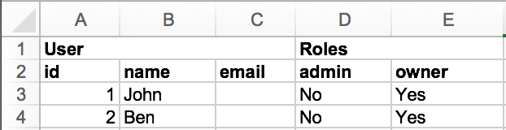

# Xport

[](https://travis-ci.org/mak-it/xport)
[](https://codeclimate.com/github/mak-it/xport)

Tabular data export to Excel, CSV, etc.

## Features

- [Header groups](#header-groups) - `column :name, group: :project`
- Column widths - `column :name, width: 10`
- Column header titles - `column :name, header: "Full name"`
- Column types - `column :name, type: :string`
- Column styles - `column :pct, style: { num_fmt: Axlsx::NUM_FMT_PERCENT, format_code: '0.0%' }`
- Cell colors - `cell.color = "AAAAAA"`
- Cell comments - `cell.comment = "..."`

## Formatters

| Feature       | csv | axlsx | rubyXL | xlsxtream |
|:--------------|:----|:------|:-------|:----------|
| Column groups | No  | Yes   | Yes    | No        |
| Column widths | No  | Yes   | Yes    | No        |
| Column types  | No  | Yes   | No*    | No        |
| Column styles | No  | Yes   | No*    | No        |
| Cell colors   | No  | Yes   | No*    | No        |
| Cell comments | No  | Yes   | No*    | No        |

\* - PRs are welcome

## Installation

Add this line to your application's Gemfile:

```ruby
gem 'xport'
gem 'axlsx' # optional
gem 'rubyXL' # optional
gem 'xlsxtream' # optional
```

And then execute:

```bash
$ bundle
```

## Usage

```ruby
class User < ActiveRecord::Base; end
User.create(name: "John")
User.create(name: "Ben")

class UserExport < Xport::Export
  include Xport::CSV
  include Xport::Axlsx

  columns do
    column :id
    column :name, header: "Full name" do |user|
      user.name.upcase
    end
    column :email do |user|
      cell = Xport::Cell.new
      cell.value = "#{user.id}@example.com"
      cell.color = "AAAAAA"
      cell.comment = "Excel comment"
      cell
    end
  end
end

UserExport.new(User.all).to_csv
UserExport.new(User.all).to_xlsx
```

Output:

```csv
id,Full name,email
1,JOHN,1@example.com
2,BEN,2@example.com
```

See [examples](examples) for more examples.

### Header groups

```ruby
class UserExport < Xport::Export
  include Xport::Axlsx

  columns do
    column(:id,    group: "User")
    column(:name,  group: "User")
    column(:email, group: "User")
    column(:admin, group: "Roles") { |u| "No" }
    column(:owner, group: "Roles") { |u| "Yes" }
  end
end

File.open("export.xlsx", "wb") do |f|
  f.write UserExport.new(users).to_xlsx.read
end
```

Output:



## Contributing

Bug reports and pull requests are welcome on GitHub at https://github.com/mak-it/xport. This project is intended to be a safe, welcoming space for collaboration, and contributors are expected to adhere to the [Contributor Covenant](http://contributor-covenant.org) code of conduct.

## License

The gem is available as open source under the terms of the [MIT License](http://opensource.org/licenses/MIT).
